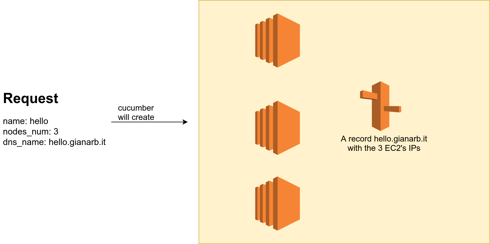

`cucumber` is a PoC about how reactive [planning
works](https://gianarb.it/blog/reactive-planning-is-a-cloud-native-pattern).

It provisions a very simple architecture on Amazon Web Service:



It reads a configuration files that looks like this one:

```yaml
name: cluster-name
nodes_num: 3
dns_name: rock
```

It takes as arguments the environment variables required by the aws-cli to
authenticate against AWS, and the route53
hosted zone (`AWS_HOSTED_ZONE`) and where to read the request file
(`CUCUMBER_REQUEST=./request.yaml`).

Example:

```bash
AWS_PROFILE=my-account \
AWS_HOSTED_ZONE=3445234534 \
CUCUMBER_REQUEST=/tmp/request.yaml cucumber
```

By default cucumber runs in the one-shot mode. It ends after the first execution
of the plan. If you pass `CUCUMBER_MODE=reconcile` it will start a
reconciliation loop.

## Test reconciliation loop

You can try to remove an AWS resource such as:

* A target from the DNS record
* The DNS record
* One or more EC2
* You can scale up the number of nodes in the request file and restart cucumber
  (scale down not supported yet)

it will recreate what you removed during one of the reconciliation process.

## Requirements
This is a PoC to describe how reactive planning works and why it is cool. So
there are some things that you need to provide and some limitations:

1. It only works on `us-east-1`
2. You need to provide a public vpc in us-east-1 tagged with `app=cucumber`
3. The nodes will be located inside a random subnets from the selected vpc

## Dependency

[gianarb/planner](https://github.com/gianarb/planner) is the library that I
wrote as foundation to write reactive planning. It contains the interface, one
scheduler and more will come...
